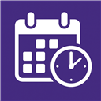

<div align="center">

  
  <h1>ClassMyCalendar</h1>

  <p>
    Export classes from Western’s DraftMySchedule to <code>.ics</code>, Google Calendar, or Outlook — Chrome and Firefox.
  </p>

</div>


> [!NOTE]
> If the extension is not working, you might want to disable other extension(s) you may have as it might be conflicting with the ClassMySchedules' extension. For any other problems, raise an issue on the Github.

SUPPORT TIMELINE: supported roughly through 2029/2030, or until Western ships an official export. Forks welcome.

## Install

### Firefox (and Zen, Floorp, LibreWolf, Waterfox)

Install from [Firefox Browser Add-ons](https://addons.mozilla.org/firefox/addon/classmycalendar/):

1. Open the listing in Firefox or another Firefox-based browser.
2. Click **Add to Firefox** and accept the permissions.
3. Pin ClassMyCalendar to the toolbar if you want it always visible.
4. Open [DraftMySchedule](https://draftmyschedule.uwo.ca/), show your class list, then click the add-on icon.
5. Export a `.ics` file, or connect Outlook for one-click sync.

Requires **Firefox 142+**. The same Firefox add-on is what you install in Zen and other Gecko browsers (`Add to Firefox` still applies).

If the store listing is not live yet, load `build/firefox` as a temporary add-on (see [Local development](#local-development)).

### Chrome

Chrome uses the Chromium package (Google Calendar sync + `.ics`). Install from the Chrome Web Store when listed, or load `build/chrome` unpacked (see [Local development](#local-development)).

| Browser | Install | Sync | Export |
|---------|---------|------|--------|
| **Firefox / Zen** | [Firefox Add-ons](https://addons.mozilla.org/firefox/addon/classmycalendar/) | Outlook | `.ics` |
| **Chrome** | Chrome Web Store or unpacked | Google Calendar | `.ics` |

# How to Use

Please navigate to DraftMySchedule, and then click on the **My Current Schedule** section. Afterwards, adhere closely to the video's instructions. https://www.youtube.com/watch?v=svZQJvF7gnI

## Features

- One-click **Export .ics** for Fall and Winter
- Auto term dates from the [Western Academic Calendar](https://www.westerncalendar.uwo.ca/SessionalDates.cfm), with a triangle disclosure for manual override
- Optional **Google Calendar** and **Microsoft Outlook** sync (OAuth)
- `.ics` works with Apple Calendar, Notion, Obsidian, and other importers
- Shared codebase for Chrome and Firefox/Zen (Gecko `browser.*` APIs, Chromium `chrome.*` fallback)

## Local development

Requirements: Node.js 20+, npm, Firefox (or Zen / another Gecko browser) for add-on testing.

End users should install from [Firefox Add-ons](#firefox-and-zen-floorp-librewolf-waterfox), not from a source checkout.

```sh
npm install
npm test
npm run lint:firefox
npm run stage
```

Staged directories:

- `build/firefox`
- `build/chrome`

### Load in Firefox (temporary / development)

Use this only while developing, or until the AMO listing is live:

1. `npm run stage`
2. `about:debugging#/runtime/this-firefox` → **Load Temporary Add-on**
3. Choose `build/firefox/manifest.json`

Or: `npx web-ext run --source-dir build/firefox`

Zen, Floorp, LibreWolf, and Waterfox use the same Firefox package (`about:debugging` still applies). Do not load the repo root in Firefox — the root `manifest.json` is the Chrome service-worker build.

### Load in Chrome

1. `npm run stage`
2. `chrome://extensions` → Developer mode → **Load unpacked** → `build/chrome`

## OAuth setup (optional sync)

Sync is browser-specific:

| Browser | Sync | Export |
|---------|------|--------|
| **Chrome** | Google Calendar | `.ics` |
| **Firefox / Zen** | Microsoft Outlook | `.ics` |

Google Web-client OAuth on Firefox/Zen is not supported (redirect UUID issues with Google Cloud).

### Google Calendar (Chrome only)

1. Create a Google Cloud project and enable the **Google Calendar API**.
2. Create an OAuth client ID with application type **Chrome Extension**.
3. Item ID = your Chrome extension ID from `chrome://extensions`.
4. Put the client ID in `manifest.json` → `oauth2.client_id` and `constants.js` → `GOOGLE_OAUTH_CLIENT_ID_CHROME`.
5. Add yourself as a test user on the OAuth consent screen while the app is in Testing.
6. Re-run `npm run stage` and load `build/chrome`.

Never put Google client secrets in the extension.

### Microsoft Outlook (Firefox / Zen only)

1. Register a public client app in Azure AD (multi-tenant + personal accounts).
2. Add SPA redirect URIs from `identity.getRedirectURL()` for your Firefox/Zen install (and Chrome’s chromiumapp.org URI if you also test elsewhere).
3. Expose delegated permission `Calendars.ReadWrite` (plus openid / profile / offline_access).
4. Set **Allow public client flows** = Yes (PKCE, no client secret).
5. Set `MICROSOFT_CLIENT_ID` in `constants.js`.
6. Re-run `npm run stage` and load `build/firefox`.

## Build release packages

```sh
npm run release
```

Creates:

- `dist/classmycalendar-firefox-v2.0.0.zip`
- `dist/classmycalendar-chrome-v2.0.0.zip`

Bump the version in `package.json`, both manifests, and the package script filenames together. Keep the Firefox `gecko.id` unchanged forever.

## Privacy

See [PRIVACY.md](PRIVACY.md). Store/AMO listings should link a stable public URL for this policy.

## Credits

Originally created for Western students. Not affiliated with Western University or DraftMySchedule.
